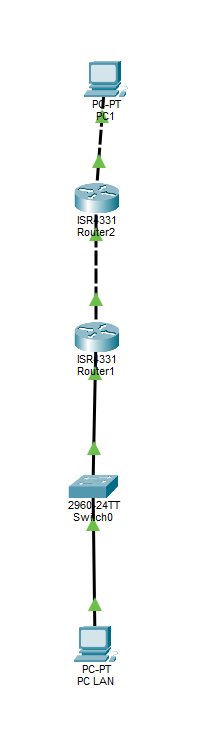
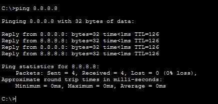
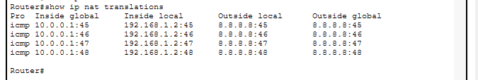

# Lab réseau - NAT Overload et diagnostic de pannes

## Objectif

Ce lab Cisco Packet Tracer a pour objectif de mettre en place un NAT Overload / PAT afin de permettre à un PC situé dans un réseau LAN privé d’accéder à un réseau externe simulant Internet.

Le lab sert aussi de base pour simuler des pannes réseau et s’entraîner au diagnostic.

L’objectif n’est donc pas seulement de faire fonctionner le NAT, mais aussi de comprendre comment identifier une panne selon les symptômes observés.

---

## Topologie

La topologie est volontairement simple afin de faciliter l’analyse et le diagnostic.

Elle contient :

* 1 PC LAN
* 1 switch
* 1 routeur NAT : R1
* 1 routeur Internet simulé : R2
* 1 PC Internet configuré avec l’adresse `8.8.8.8`

Schéma de la topologie :



---

## Rôle des équipements

### PC LAN

Le PC LAN représente une machine située dans un réseau privé.

Il doit pouvoir communiquer avec le PC Internet en passant par le routeur R1.

### R1 - Routeur NAT

R1 est le routeur principal du lab.

Il a plusieurs rôles :

* servir de passerelle pour le réseau LAN ;
* faire le routage vers le réseau externe ;
* traduire l’adresse privée du PC LAN grâce au NAT Overload / PAT.

### R2 - Internet simulé

R2 représente un routeur situé sur un réseau externe.

Il ne fait pas de NAT.
Il sert uniquement à simuler le chemin vers Internet.

### PC Internet

Le PC Internet est configuré avec l’adresse `8.8.8.8`.

Il sert de cible de test pour vérifier que le PC LAN peut joindre un réseau externe.

---

## Pourquoi il n’y a pas de serveur DNS

Dans ce lab, les tests sont effectués directement avec une adresse IP :

```bash
ping 8.8.8.8
```

Le DNS n’est donc pas nécessaire, car aucune résolution de nom n’est utilisée.

Un serveur DNS serait utile uniquement si le test était effectué avec un nom de domaine, par exemple :

```bash
ping www.test.local
```

Dans ce projet, le but est de travailler le NAT, le routage et le diagnostic réseau.
Le DNS sera traité dans un lab séparé.

---

## Plan d’adressage

### Réseau LAN

| Équipement | Interface     | Adresse IP  | Masque        | Passerelle  |
| ---------- | ------------- | ----------- | ------------- | ----------- |
| PC LAN     | FastEthernet0 | 192.168.1.2 | 255.255.255.0 | 192.168.1.1 |
| R1         | Interface LAN | 192.168.1.1 | 255.255.255.0 | -           |

### Réseau entre R1 et R2

| Équipement | Interface         | Adresse IP | Masque        |
| ---------- | ----------------- | ---------- | ------------- |
| R1         | Interface WAN     | 10.0.0.1   | 255.255.255.0 |
| R2         | Interface vers R1 | 10.0.0.2   | 255.255.255.0 |

### Réseau Internet simulé

| Équipement  | Interface                      | Adresse IP | Masque        | Passerelle |
| ----------- | ------------------------------ | ---------- | ------------- | ---------- |
| R2          | Interface vers Internet simulé | 8.8.8.1    | 255.255.255.0 | -          |
| PC Internet | FastEthernet0                  | 8.8.8.8    | 255.255.255.0 | 8.8.8.1    |

---

## Fonctionnement attendu

Le PC LAN utilise une adresse privée en `192.168.1.0/24`.

Cette adresse privée n’est pas utilisée directement pour communiquer avec le réseau externe.

Quand le PC LAN envoie du trafic vers `8.8.8.8`, le routeur R1 traduit l’adresse privée `192.168.1.2` en utilisant son adresse côté WAN `10.0.0.1`.

Le chemin attendu est donc :

```text
PC LAN → Switch → R1 NAT → R2 Internet simulé → PC Internet 8.8.8.8
```

---

## Configuration de R1

R1 est le routeur qui réalise le NAT.

### Configuration des interfaces

```bash
enable
configure terminal

interface gigabitethernet 0/0/0
ip address 192.168.1.1 255.255.255.0
ip nat inside
no shutdown
exit

interface gigabitethernet 0/0/1
ip address 10.0.0.1 255.255.255.0
ip nat outside
no shutdown
exit
```

L’interface côté LAN est déclarée avec :

```bash
ip nat inside
```

L’interface côté réseau externe est déclarée avec :

```bash
ip nat outside
```

Cette distinction est essentielle, car elle permet au routeur de savoir dans quel sens il doit effectuer la traduction NAT.

---

### ACL utilisée pour le NAT

```bash
access-list 1 permit 192.168.1.0 0.0.0.255
```

Cette ACL indique au routeur quelles adresses IP ont le droit d’être traduites.

Ici, seul le réseau LAN `192.168.1.0/24` est autorisé à utiliser le NAT.

---

### Activation du NAT Overload / PAT

```bash
ip nat inside source list 1 interface gigabitethernet 0/0/1 overload
```

Cette commande active le NAT Overload.

Elle signifie que les adresses autorisées par l’ACL 1 seront traduites en utilisant l’adresse IP de l’interface WAN de R1.

Le mot-clé `overload` permet à plusieurs machines du réseau LAN de partager la même adresse IP externe grâce aux ports.

---

### Route par défaut

```bash
ip route 0.0.0.0 0.0.0.0 10.0.0.2
```

Cette route indique à R1 d’envoyer vers R2 tout le trafic destiné à un réseau qu’il ne connaît pas.

Sans cette route, R1 ne saurait pas où envoyer le trafic destiné à `8.8.8.8`.

---

## Configuration de R2

R2 simule un routeur situé sur Internet.

```bash
enable
configure terminal

interface gigabitethernet 0/0/0
ip address 10.0.0.2 255.255.255.0
no shutdown
exit

interface gigabitethernet 0/0/1
ip address 8.8.8.1 255.255.255.0
no shutdown
exit
```

R2 permet de relier le réseau `10.0.0.0/24` au réseau Internet simulé `8.8.8.0/24`.

---

## Tests de validation

### Test 1 - Ping depuis le PC LAN vers 8.8.8.8

Depuis le PC LAN :

```bash
ping 8.8.8.8
```

Résultat attendu :



Ce test permet de vérifier que :

* le PC LAN utilise la bonne passerelle ;
* R1 reçoit le trafic du réseau LAN ;
* R1 applique le NAT ;
* R1 route le trafic vers R2 ;
* R2 permet d’atteindre le PC Internet.

---

### Test 2 - Vérification des traductions NAT

La commande suivante est exécutée sur R1, car R1 est le routeur qui réalise le NAT :

```bash
show ip nat translations
```

Résultat obtenu :



La table NAT montre que l’adresse privée du PC LAN `192.168.1.2` est traduite en `10.0.0.1` lorsque le PC LAN communique avec `8.8.8.8`.

Exemple de traduction observée :

```text
Inside local   : 192.168.1.2
Inside global  : 10.0.0.1
Outside global : 8.8.8.8
```

Cela confirme que le NAT Overload / PAT fonctionne correctement.

---

## Méthode de diagnostic utilisée

Pour diagnostiquer une panne, j’utilise la méthode suivante :

```text
observation → tests → résultats → hypothèses → correction → validation
```

L’objectif est d’éviter de modifier la configuration au hasard.

Chaque test doit permettre de confirmer ou d’éliminer une hypothèse.

---

## Scénarios de pannes à simuler

Le lab doit rester fonctionnel par défaut.

Les pannes suivantes peuvent ensuite être simulées volontairement pour s’entraîner au diagnostic.

| Panne simulée                          | Symptôme observé                      | Commande utile                     | Cause probable                              |
| -------------------------------------- | ------------------------------------- | ---------------------------------- | ------------------------------------------- |
| Mauvaise passerelle sur le PC LAN      | Le PC LAN ne sort pas du réseau local | `ipconfig` puis `ping 192.168.1.1` | Mauvaise configuration IP locale            |
| Interface LAN de R1 désactivée         | Le PC LAN ne ping pas sa passerelle   | `show ip interface brief`          | Interface down                              |
| Interface WAN de R1 désactivée         | R1 ne joint plus R2                   | `ping 10.0.0.2`                    | Lien R1-R2 coupé                            |
| Route par défaut absente sur R1        | Le PC LAN ne joint pas `8.8.8.8`      | `show ip route`                    | R1 ne sait pas où envoyer le trafic externe |
| `ip nat inside` absent                 | Pas de traduction NAT                 | `show running-config`              | Interface LAN non déclarée côté NAT inside  |
| `ip nat outside` absent                | Pas de traduction NAT correcte        | `show running-config`              | Interface WAN non déclarée côté NAT outside |
| ACL NAT incorrecte                     | Le trafic LAN n’est pas traduit       | `show access-lists`                | Mauvais réseau autorisé dans l’ACL          |
| Mauvaise passerelle sur le PC Internet | Le ping peut ne pas revenir           | Configuration IP du PC Internet    | Problème de retour réseau                   |

---

## Raccourcis de diagnostic

Quelques repères utiles :

* Gateway KO → problème local
* IP en `169.254.x.x` → problème DHCP
* Ping IP externe KO → problème de routage ou de NAT
* Ping nom KO mais ping IP OK → problème DNS
* `show ip nat translations` vide → NAT non déclenché ou mal configuré
* `show ip route` incomplet → problème de routage

---

## Ordre conseillé pour diagnostiquer

En cas de panne, je vérifie dans cet ordre :

1. L’adresse IP du PC LAN
2. La passerelle du PC LAN
3. Le ping vers `192.168.1.1`
4. L’état des interfaces avec `show ip interface brief`
5. Le ping entre R1 et R2
6. La route par défaut sur R1
7. La configuration NAT inside / outside
8. L’ACL utilisée par le NAT
9. La table NAT avec `show ip nat translations`

Cet ordre permet de partir du plus proche vers le plus éloigné.

---

## Résultat attendu

Lorsque le lab est correctement configuré :

* le PC LAN peut ping `8.8.8.8` ;
* R1 peut joindre R2 ;
* R2 peut joindre le PC Internet ;
* la commande `show ip nat translations` affiche des traductions NAT ;
* les pannes peuvent être simulées et diagnostiquées méthodiquement.

---

## Compétences développées

* Configuration du NAT Overload / PAT
* Compréhension du rôle de `ip nat inside`
* Compréhension du rôle de `ip nat outside`
* Utilisation d’une ACL pour sélectionner le trafic à traduire
* Configuration d’une route par défaut
* Vérification avec `show ip nat translations`
* Diagnostic réseau avec `ping`
* Lecture de la table de routage
* Analyse progressive d’une panne réseau
* Différenciation entre problème local, routage, NAT et DNS

---

## Utilité professionnelle

Ce lab se rapproche d’une situation réelle d’administration réseau.

En entreprise, lorsqu’un poste ne parvient pas à accéder à Internet, il faut vérifier progressivement :

* la configuration IP du poste ;
* la passerelle ;
* l’état des interfaces ;
* le routage ;
* la configuration NAT ;
* le retour réseau.

Ce projet montre donc une compétence importante : savoir configurer un service réseau, mais aussi savoir diagnostiquer une panne de manière structurée.

---

## Fichiers du projet

* `lab-nat-diagnostic-pannes.pkt`
* `topologie-nat.png`
* `ping-lan-vers-8.8.8.8.png`
* `show-ip-nat-translations.png`

---

## Outils utilisés

* Cisco Packet Tracer
* Cisco IOS CLI
* Tests ICMP
* Commandes de diagnostic réseau
